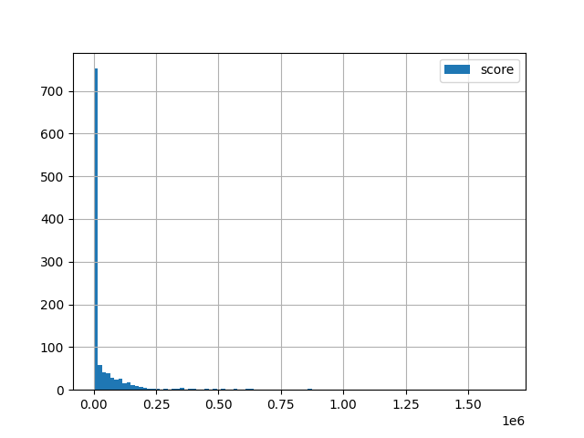

# dropout-similar-images
Here is a small project to filter out similar images from a directory.


# Intro
The program is being delivered as a python package. For convenience, 
to avoid any question on environment, there is a Dockerfile to build a container
with all needed settings to run the app.

This report is organized as follows: 
* firstly, I describe how to build the docker image, run the container 
with app and see how the app works;
* secondly, I answer the questions formulated at the end of the challenge conditions.

# 1. Run the app

The app is delivered as sources and a python package, so you can build it and 
install on your host. For convenience, you can run the app in a docker container.
In this case, you need to build the image and run the container
with mounted dataset and output directories. 

## 1.1 Build a container
Please, pull this repo, `cd` to its root, and finally run `docker build ...`.
These commands should look as follows
```shell

cd /path/to/dropout-similar-images
docker build -t dataset-proc-img -f docker/Dockerfile .
```

## 1.2 Run the app
After that, you can run the container with app launched. Fot that, run 
a command like following
```shell
docker run \
    --rm \
    -v /path/to/dataset:/dataset \
    --name dataset-proc \
    dataset-proc-img \
    remove-similar-images \
    --dataset-path /dataset \
    --output-dir-path /dataset/selected \
    --min-contour-area-diff 30000 \
    --min-imsize-percentile 75 \
    --min-imsize-scale 0.5 \
    --black-mask 10 10 10 10 \
    --gaussian-blur-radii 11 15 \
    --min-contour-area 1000 \
    --save-data-analysis-plots-to /dataset/data-analysis
```

The parameter meaning you can get with `remove-similar-images --help`:
```shell
$ remove-similar-images --help
usage: The program removes similar images from a dataset and saves selected images to an output directory.

options:
  -h, --help            show this help message and exit
  --dataset-path DATASET_PATH
                        A path to a directory with dataset to be cleaned.
  --image-file-extensions IMAGE_FILE_EXTENSIONS [IMAGE_FILE_EXTENSIONS ...]
                        Image file extensions to be processed.
  --min-contour-area-diff MIN_CONTOUR_AREA_DIFF
                        Minimum difference between total contour areas in two images. If difference is
                        smaller than that, the images are supposed to be similar.
  --output-dir-path OUTPUT_DIR_PATH
                        An directory path to save selected images to.
  --min-imsize-percentile MIN_IMSIZE_PERCENTILE
                        To estimate minimum allowable images size, the app calculates q-th percentile
                        of all image sizes and multiplies it by scale (defined by '--min-imsize-
                        scale'). Should be in the integer range [0, 100]
  --min-imsize-scale MIN_IMSIZE_SCALE
                        To estimate minimum allowable images size, the app calculates q-th percentile
                        of all image sizes and multiplies it by scale defined by this parameter. Should
                        be a float number.
  --min-contour-area MIN_CONTOUR_AREA
                        Minimum contour area to be considered when sismilarity estimating.
  --gaussian-blur-radii GAUSSIAN_BLUR_RADII [GAUSSIAN_BLUR_RADII ...]
                        A list of gaussian blur radii to pre-process input images and make contour
                        estimation more robust. They should be odd integers.
  --black-mask BLACK_MASK [BLACK_MASK ...]
                        Mask to crop a some interior part of an image and make black the other (border)
                        part. Should be a list of 4 integers: [xmin, ymin, xmax, ymax] in percents of
                        the image size.
  --save-data-analysis-plots-to SAVE_DATA_ANALYSIS_PLOTS_TO
                        A directory path to save dataset statistics to.
  --log-level {info,warning,error}
                        A log level to print in a terminal.


```

# 2. Questions and Answers

## 1. What did you learn after looking on our dataset?
I noticed the following points:
* the dataset is a set of video frames taken by a couple of cameras
* there are images of a different sizes even if they have the same camera id
* there are two formats of timestamp -- timestamps in milliseconds and 
datetimes up to seconds
* the majority of frames looks like similar images
* some frames contain paving slabs, that's why it seems reasonable to adjust
gussian blur  radii to blur slabs (sizes 11 and 15 looks good)
* there are two bad images -- one is too small (the size is 6x10), another one 
couldn't be read

## 2. How does you program work?

The whole pipeline is defined in the method `DataCleaner.run` 
(see `src/data_processor/cleaner.py`). 

__High-level steps__ are the following:

__1.__ Read all filenames in the dataset directory, group them 
by camera id and sort each group by timestamps. After that, I can use
the function `compare_frames_change_detection` for two consecutive frames as it
obviously expects (looking at it signature).

Becuase I don't know how much datasets could be, I load in the memory no more
than two images. That's why I need two pass through the data--one to define
appropriate images size to filter out all unreasonable small images; 
and the second one, to process the images and calculate the similarity score.

So, the next step is

__2.__ Define a smallest allowable image size to skip all smaller images.
For that, I read all image sizes in the dataset, calculate a percentile 
(e.g. 75th, see the CLI parameter `--min-imsize-percentile`),
assume all images with the sizes bigger than that scaled quantile are good, -- 
$`image_size >= scale * quantile_image_size`$. The `scale` is defined
with the CLI parameter `--min-imsize-scale`.

__3.__ Read the dataset again with ignoring small images; calculate similarity
score, save statistical plots and parameters used.

__4.__ Remove all low-score records from a dataframe and save all the other
in an output directory defined with the CLI `--output-dir-path`.

## 3. What values did you decide to use for input parameters and how did you find these values?
How I'm dealing with different image sizes, I describe in the section 5.1. 
below, please, have look at there.

Then let's discuss algorithmic parameters.

### 3.1. `min_contour_area` and `min-contour-area-diff`

This is the minimum threshold for the similarity score value. 
Its physical meaning of contour area here is area of image difference.
In other words, it tell us how much are contours different in two images.

So, in general case, you can estimate how much pixels can be different
on a base of task context (e.g. what system do we develop--
video surveillance system, or some event detection system, or any else). 
Because, according to the problem formulation, I need just to remove 
"non-essential" images, I got a guess after looking through the dataset.

There is a samples of video streams from a couple of cameras. So, there
is a lot of almost similar images. The histogram of scores is presented below.



The statistic estimations are looking like (`min_contour_area==100`, almost
all contours are in the statistics)
```markdown
count    6.960000e+02
mean     9.934679e+04
std      1.902682e+05
min      1.055000e+02
25%      4.488500e+03
50%      2.616300e+04
75%      1.094531e+05
max      2.054210e+06
```
We see that 75% of the images have the score smaller than `2.616300e+04`.

So, it looks like a reasonable value for `min_contour_area` is `1000` 
(most similar 25% of all images will be skipped). After that the data statistics
will look like the following
```markdown
          timestamp         score
count  1.078000e+03  1.078000e+03
mean   1.618101e+09  4.276533e+04
std    2.356076e+06  1.166045e+05
min    1.616689e+09  0.000000e+00
25%    1.616760e+09  0.000000e+00
50%    1.616804e+09  0.000000e+00
75%    1.619532e+09  3.246050e+04
max    1.623914e+09  1.647858e+06
```

The threshold for score (CLI parameter `min-contour-area-diff`) could then
be set to `30000`. In this case, 70% of the original images will be dropout and 
only 30% will be understood as dissimilar ones.

The precise value of `min-contour-area-diff` is different for deifferent datasets.
The less it is, the more images are selected, and the more chances to select
similar images.

### 3.2. `gaussian_blur_radii`

The more values we take and the more each radius is, the more details will
get blurred in images. It's useful to blur paving slabs in some images, 
or any else small details which can be contours and influence on the score.
Here, blur can be kind of denoising to make the same objects (contours) look 
similar without respect to shadows or illuminations.

I played a little bit with that, and chose the list `[11, 15]`. If not to take
very big values (comparing with the image size), the influence on the result
is not so big as `min_contour_area` and `min-contour-area-diff`.

### 3.3. `black_mask`

I didn't changed this parameter a lot because I preferred to scale the images 
with different sizes instead of cropping. Just to not skip big contours
near to the boundaries. But, may be, in some cases (or for some tasks) 
it could be more powerful. I used just `[10, 10, 10, 10]` to make 
the score estimation more robust to appearing and disappearing objects
close to the boundaries of frames.

## 4. What you would suggest to implement to improve data collection of unique cases in future?

__1.__ I would standardize timestamps and image sizes. 
In real-time solutions, we
don't have an opportunity to look through a whole dataset to see what 
image size is much frequent to set it as a 'normal' one. In off-line applications, 
it could save time.

__2.__ We could use more preprocessing like histogram equalization to make 
the app more robust to illumination and weak shadows.

__3.__ If data will be collected with moving cameras,
then I would try to use other similarity scoring technics, 
like DBoW (from ORB-SLAM)

__4.__ I would try to use the image hash approach for similarity scoring.

## 5. Any other comments about your solution?

### 5.1. Dealing with different image sizes
As it said in the conditions of the challenge, for image comparison, 
I can use the only functions in the file `imaging_interview.py` 
(I renamed it to `src/dataset_processor/image_comparators.py`).

Because the function `cv2.absdiff` in the function `compare_frames_change_detection`
requires input images of the same size and doesn't make a check, 
I should provide it on my side. Here are three simplest strategies:
* to crop the biggest of two images
* to down-scale the biggest of two image
* to up-scale the smallest of two images

The score function is a total area of all not-matching contours in an image when
too small contours are ignored. Beside that it's not a semantic measure,
that's why, as I feel, loss of information (down-scaling) is better that 
adding noises (up-scaling). I didn't use crop because, in that case, we can 
cut off some big objects which are close to the border (cars, people etc.).
When I scale an image, I can squeeze a contour at some point, and 
it can turn into a couple of contours, some of them could be filtered out 
as too small ones. This is a disadvantage of the heuristic I choose. 

In the real life, I prefer to get more context about the conditions which
the algorithm is used in. What are dissimilar enough images--are those images
between ones' timestamps something happened, or just moving big spot of light
when sunset is enough? In other words, what a human think should be selected?

In the task formulation, there is written that we don't take into account
any semantic features in images, just use the provided functions 
to get similarity score.

So, as I feel, scaling is quite good approach for this task and provided 
score estimators. For any other tasks, it's a topic for discussion.

To filter out all too small images, I read images and save their size, 
define percentile of that sample. The percentile is defined with the 
CLI parameter `--min-imsize-percentile`. It shouldn't be too small--we 
should take the size of a majority of images. That's why I used 75th percentile.

Then we say that if the current image is smaller than this 'common' image
in no more than `scale` times, then we can upscale it without unreasonable 
noises. So, it holds true `good_image_size > scale * percentile`.
I used `scale=0.5` because such nearest-neighbour scaling doesn't change
contours in a majority of the images of the dataset, and allows to skip
the image `c21_2021_03_27__12_53_37.png` of the size `6x10`.

After that, all images excepting `c21_2021_03_27__12_53_37.png` and
`c21_2021_03_27__10_36_36.png` (is broken) are read and processed good. 
That's why I feel this approach of processing different image size
quite good too for this dataset.
